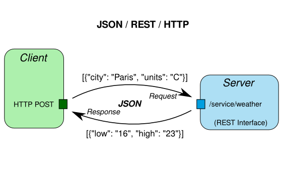

# Laravel Client

This Package for Laravel Client Consume API (Web Service)


## Requirement
In Your Project you must install ``guzzlehttp/guzzle`` version 6.2 or latest version.

## Install Package Composer

#### There are 2 ways to install this package :

Install via "composer"
```code
$ composer require rdj/client "dev-master"
```
#### or
Add the manual in composer.json

   Step 1
   ```code
   {
      ...
      "require"{ 
           "rdj/client" : "dev-master"
      }
   }
   ```
   Step 2
   ```code
   $ composer update
   ```

## Integration on Laravel Config

Register the Provider in the `config/app.php` file:
```code
'providers' => [
	....

	Rdj\Client\ClientServiceProvider::class,
]
```
Add facade aliases in the same file `config / app.php`:
```code
'aliases' => [
    ....

   'Client'    => Rdj\Client\Facades\Client::class,
]
```
Publish the package configuration file using the following command:
```code
$ php artisan vendor:publish
```

## Setting Enviroment (.env)
Edit file `.env` add the following code:
```code
WEB_SERVER_URI=your_web_server_uri (e.g: https://webserver.com/ )
BASE=your_base (e.g: int/ or eks/ or mobile/ or api/v1/ )
```

## How to use
### In your controller:
  
#### Get data from your web server without `authorization in header`:
```code
....

use Client;

Class YourController extends Controller
{

....

   public function getData()
   {
      $getdata = Client::setEndpoint('your_endpoint')
                    ->setHeaders([])
                    ->setQuery([])
                    ->get();
        return response()->json( $getdata );
   }

}
```
#### Get data from your web server with `authorization in header`:
```code
....

use Client;

Class YourController extends Controller
{

....

   public function getData()
   {
      $getdata = Client::setEndpoint('your_endpoint')
                    ->setHeaders(['authorization' => 'your_token'])
                    ->setQuery([])
                    ->get();
        return response()->json( $getdata );
   }

}
```
#### Get data from your web server with `authorization in header` and `parameter query`:
```code
....

use Client;

Class YourController extends Controller
{

....

   public function getData()
   {
      $getdata = Client::setEndpoint('your_endpoint')
                    ->setHeaders(['authorization' => 'your_token'])
                    ->setQuery(['search' => 'jhondee'])
                    ->get();
        return response()->json( $getdata );
   }

}
```
#### Post data from your web server with `authorization in header` and `parameter body`:
```code
....

use Client;

Class YourController extends Controller
{

....

   public function postData(Request $request)
   {
      $param_post = $request->all();
      $getdata = Client::setEndpoint('your_endpoint')
                    ->setHeaders(['authorization' => 'your_token'])
                    ->setBody($param_post)
                    ->post();
        return response()->json( $getdata );
   }

}
```

#### Multipart Post data from your web server with `authorization in header` and `parameter body`:
```code
....

use Client;

Class YourController extends Controller
{

....

   public function postDataMultipart(Request $request)
   {
      $param_post = $request->all();
      $getdata = Client::setEndpoint('your_endpoint')
                    ->setHeaders(['authorization' => 'your_token'])
                    ->setBody($param_post)
                    ->post('multipart');
        return response()->json( $getdata );
   }

}
```

#### Delete data from your web server with `authorization in header` and `parameter body`:
```code
....

use Client;

Class YourController extends Controller
{

....

   public function DeleteData($id)
   {
      $getdata = Client::setEndpoint('your_endpoint/'.$id)
                    ->setHeaders(['authorization' => 'your_token'])
                    ->deleted();
        return response()->json( $getdata );
   }

}
```

## Contributing

1. Fork it (<https://github.com/ranggadarmajati/LaravelClient/fork>)
2. Create your feature branch (`git checkout -b feature/fooBar`)
3. Commit your changes (`git commit -am 'Add some fooBar'`)
4. Push to the branch (`git push origin feature/fooBar`)
5. Create a new Pull Request

## License
This Package have license under MIT License